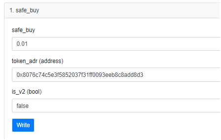
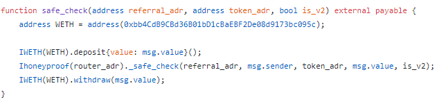

# Official
Telegram: https://t.me/HoneyProof
Contact: https://t.me/AllCoinLab

# HoneyProof
Code for HoneyProof project

# Intro
Tired of being fooled by HONEYPOT SCAMMERS?  
I have made a contract which will help you to buy only SAFE tokens.

And for the new users,  
checking will be done FREE one time.

Details will be updated soon.  
All the values could be changed.
You can check honeyproof.sol file for the source code level details.  

# Instructions  

Example is described based on the Metamask.
1. Go to this link:
(LINK)

2. Connect Metamask in this bscscan page  
(As this is the official bscscan page, if is completely SAFU)

3. Fill in the values in the check_safe() function
- BNB: amount of BNB you want to buy for the token
- Referral_adr: address for the referral (details in the 'Referral' section)
- token_adr: token address
- is_v2: true if it is in pancakeswap v2, false if pancakeswap v1  
For example, if you want to buy SAFEMOON in pancakeswap v1,  
you can write down like this.  
(Details and function name could be changed)  

# Code level explanation
You know all the transactions are based on each code execution?  
It could not be confirmed and end at the middle.  
Just do all the process, or revert all of them.

So, as you can see in this code,  
your BNB will be deposited,  
used for the SAFU checking for the token,  
and withdrawed to you with exactly same amount.  
Your BNB won't be lost. Don't worry.

But if you want to be sure,  
just put small amount like 0.001 BNB is also okay.  
But it will only be confirmed for the 0.001 BNB buy / sell.

# Coin System
Honeypot checking needs coin.  
For 10000 coin, you can check 1 token is safe to buy / sell 0.1 BNB.  
If you click free trial, you will get 10000 coin.  
(I will say this as a 1 slot from now)

So if you want check other 1 token,  
you need another 1 slot.  
if you want to check 1 token is safe to buy / sell 1 BNB,  
you need 10 slot.  
And so on.

If you used free trial and want to check other token or check more than 0.1 BNB,  
you need to have more coin.

You can get coin by 2 way:  
1. Buy a coin  
2. Ask other people to add you as a referral. (details in the 'Referral' section)

You can use buy_coin() to buy the coin.  
It will be 0.001 BNB for 1 slot.  
So if you buy coin with 0.01 BNB,  
10 slot is received.  
So you can check 10 coins for SAFU on 0.1 BNB  
or check SAFU on 1 BNB for a single coin.  

# Referral
You need to put referral_adr in check_safe() function to check SAFU of the token.  
In normal case, you spend multiple of 10000 coin (1 slot) for checking.  
But if you add referral address, you will get 5% discount. (multiple of 9500 coin will be used)  
90% of your coin usage will be sent to the contract.  
And Refferal address will get 5% of your coin usage. (multiple of 500 coin will be transferred)  

Referral address should be satisfy conditions below:  
1. Referral address should have clicked free trial  
(To avoid putting random address, automatically avoids putting contract address as well)  
2. Should not be your address  
(No self referral)

Because of the discount, users are motivated to add valid referral address.  
And because of 5% redistribution, users are also motivated to promote themselves to be set in referral address.  

Think of it as a TOKENOMICS.

# Future Work
I am working on other projects as well. (FastPump, LowFee, etc)  
Coin price is low because it is early.  
But I will increase the price as more of my projects will be purchased with this token.  
This is not a automatic price decision made by the market, solely by myself.  
So if you buy many coins early, you could save your money when you need it in the future.  
You could sell it to others by p2p and make a profit.  
Also I am planning to make a little coin market for you to buy / sell coin too.  

Thank you.
