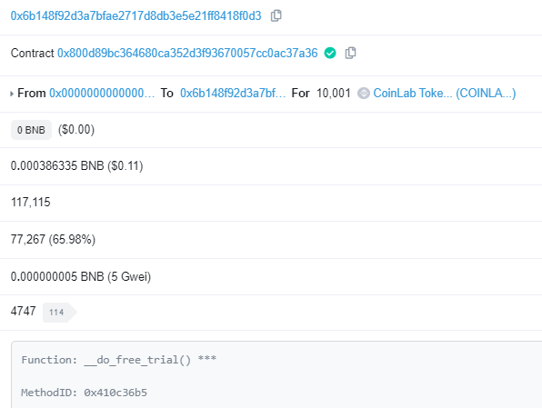

# Official
Telegram: https://t.me/HoneyProof  
Contact: https://t.me/AllCoinLab

# HoneyProof
Code for HoneyProof project  
Contract & To use this:  
https://bscscan.com/address/0x800D89Bc364680cA352d3f93670057CC0AC37A36#writeContract

# Intro
Tired of being fooled by HONEYPOT SCAMMERS?  
I have made a contract which will help you to buy only SAFE tokens.

And for the new users,  
checking will be done FREE one time.

Details will be updated soon.  
All the values could be changed.  
You can check honeyproof.sol file for the source code level details.  

All the instructions and examples are described based on the Metamask.

# Full Instruction with using Free Trial

## Connecting metamask to bscscan

If you know how to do it, skip this :)

Go to this link and click 'Connect to Web3':  
https://bscscan.com/address/0x800D89Bc364680cA352d3f93670057CC0AC37A36#writeContract

Then you will see this image. Click Metamask to connect your wallet for bscscan.  

Some warnings from the bscscan page. Click confirm if you trust bscscan :)  

Then your metamask wallet will be connected to bscscan.  

## Getting Free coin 

Click 'Write' button in do_free_trial()  

Click confirm to get free coin to use this honeypot checker.  

Click 'Read Contract' or click this link to check your free coin.  
https://bscscan.com/address/0x800D89Bc364680cA352d3f93670057CC0AC37A36#readContract  
put your address and click 'query' in get_balance().  
You can see free token is set like this picture.  

Or you could check in the bscscan. (example of free trial usage)  
https://bscscan.com/tx/0xee14a4ec99dfef431ed8042cb504759fa1d522e633d7e8d856a9ea6327a326fe  

## Use this free coin to check honeypot
Click 'Write Contract' or click this link:  
https://bscscan.com/address/0x800D89Bc364680cA352d3f93670057CC0AC37A36#writeContract  

Go to safe_check() and fill in the values
- safe_check: amount of BNB you want to buy for the token
- Referral_adr: address for the referral (details in the 'Referral' section)
- token_adr: the target token address to check honeypot
- is_v2: 'true' if it is in pancakeswap v2, 'false' if pancakeswap v1  

For example, if you want to check PH coin on pancakeswap v1 for 0.1 BNB,  
you can put in like this.  
Referral set could be set to your wallet address for tutorial.  
(not recommended because of no discount, see the 'Referral' section for more)  

Click confirm at the metamask popup.
As I have set 0.1 BNB for check,  
0.1 BNB will be added to be used for honeypot check.  
It will be refunded to you.  
(SAFU check details in the 'Code Explanation' section)  

Click 'View your transaction' and wait for the transaction get confirmed.  

Click 'Logs' tab  

At the middle of the logs,
you can check the result of the honeypot check.  
If it cannot be selled, 'SCAM' will be displayed like below.
You can click token_adr for details.  
https://bscscan.com/tx/0x782a24b36a5969f7bb2bd04f2745b3fd3193a52ac4ca591e9777abb5aacd9cd5

PH token in this case is the typical honeypot scam coin  
And as you can see, contract code is not even verified.  
### AND THIS TOOL CAN CHECK HONEYPOT IF NOT EVEN VERIFIED.  
You can check safu and get in early to get moonshot :)  
https://www.reddit.com/r/CryptoCurrency/comments/mkoelx/beware_of_honeypot_scam_phbnb/  
https://bscscan.com/address/0x639e7972244bbdf70f4ad1aad970b26e45c6d3de#comments  

And if it can be selled properly, 'SAFU' will be displayed like below.  
(HOTDOGE token on pancakeswap v1 for 0.1 BNB was used as a example)  
https://bscscan.com/tx/0x7b70565b5d2eadb9578d9c3fb26e54eae2951b09e03184a703a5a7054481af31  

# Code level explanation

You know all the transactions are based on each code execution?  
It cannot be partially end at the middle.  
Just do all the process, or revert all of them.

So, as you can see in this code,  
your BNB will be deposited,  
used for the SAFU checking for the token,  
and withdrawed / transferred to you with exactly same amount.  
Your BNB won't be lost. Don't worry.  

Example for the refund process  
0x6b14... is the wallet address.  
You can see that 0.1 BNB is refunded.  
https://bscscan.com/tx/0x7b70565b5d2eadb9578d9c3fb26e54eae2951b09e03184a703a5a7054481af31#internal  

But if you want to be sure,  
just put small amount like 0.001 BNB is also okay.  
But it will only confirm the target token for the 0.001 BNB buy / sell.

# Coin System
Honeypot checking needs coin.  
For 10000 coin, you can check 1 token is safe to buy / sell 0.1 BNB.  
If you click do_free_trial(), you will get 10001 coin. (+1 is for the checking)  
(I will say this as a 1 slot from now)

So if you want check other 1 token, you need another 1 slot.  
if you want to check 1 token is safe to buy / sell 1 BNB, you need 10 slot.  
And so on.

If you used free trial and want to check other token or check more than 0.1 BNB,  
you need to have more coin.

You can get coin by 2 way:  
1. Buy a coin  
2. Ask other people to add you as a referral. (details in the 'Referral' section)

You can use buy_coin() to buy the coin.  
It will be 0.001 BNB for 1 slot.  
So if you buy coin with 0.01 BNB,  
10 slot is received.  
So you can check 10 coins for SAFU on 0.1 BNB  
or check SAFU on 1 BNB for a single coin.  
Also you can use donate() to support me :)  

Example transaction  
https://bscscan.com/tx/0x48b7b7cd4b5cc26225e92b81bf37531fc0a925355dd84bee552aa88bc9aa7c95  

# Free Trial
If you click do_free_trial(),  
you will get 10000 coin (1 slot) to check.   
You can use it only 1 time.  
And you should have at least 0.01 BNB in your wallet to use this function.  
(To avoid abusing)  

# Referral
You need to put referral_adr in check_safe() function to check SAFU of the token.  
If you add your address in the referral_adr, you spend multiple of 10000 coin (1 slot) for checking.  

But if you add referral address, you will get 20% discount. (multiple of 8000 coin will be used)  
60% of your coin usage will be sent to the contract.  
And Referral address will get 20% of your coin usage. (multiple of 2000 coin will be transferred to the referral)  

So if you add referral address 5 times, you can get 1 free time.  
if you have been added to the referral address 5 times, also can get 1 free time.  
Because of the discount, users are motivated to add valid referral address.  
And because of redistribution, users are also motivated to promote themselves to be set in referral address.  
Think of it as a TOKENOMICS.  

Referral address should satisfy conditions below:  
1. Referral address should have clicked free trial  
(To avoid putting random address, automatically avoids putting contract address as well)  
2. Should not be your address  
(No self referral)

 
# Future Work
I am working on other projects as well. (FastPump, LowFee, etc)  
Coin price is low because it is early.  
But I will increase the price as more of my projects will be purchased with this token.  
This is not a automatic price decision made by the market, solely by myself.  
So if you buy many coins early, you could save your money when you need it in the future.  
You could sell it to others by p2p and make a profit.  
Also I am planning to make a little coin market for you to buy / sell coin too.  

Thank you.
